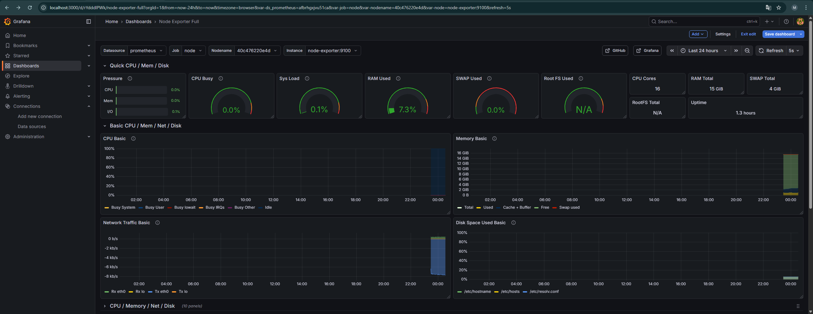

# 🛠 Ansible & DevOps Playground

Репозиторий для практики Infrastructure as Code (IaC).
Развертывание веб-серверов и мониторинга в среде Linux (WSL).

## 🚀 Технологии
* **Ansible:** Автоматизация настройки сервера (Nginx).
* **Docker & Docker Compose:** Контейнеризация сервисов.
* **Linux (Ubuntu):** Целевая платформа.

## 📦 Как запустить
1. Настроить инвентарь `hosts.ini`.
2. Запустить плейбук:
   ```bash
   ansible-playbook -i hosts.ini install_nginx.yml -K

## 📊 Мониторинг ресурсов
Развернут стек Prometheus + Grafana + Node Exporter.
Сбор метрик системы (CPU, RAM, Disk) в реальном времени.


